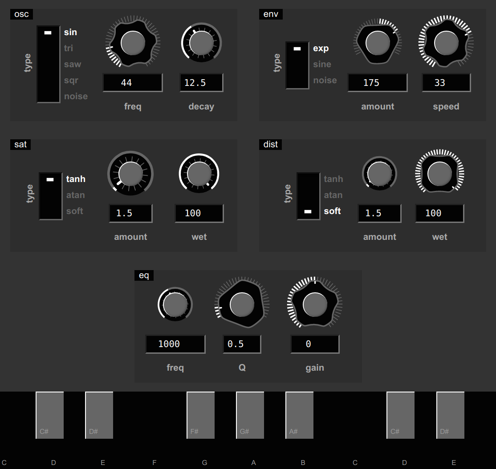

# WebAudio WebComponents



## Description

This repo is two things:

1. A set of Web Components to create WebAudio graphs plus a set of GUI elements for parameter controlling and automation.

```html
<w-context id="wa">
  <w-worklet name="noise" src="./noise.js">
    <w-piano></w-piano>

    <div style="display: flex; margin: 20px">
      <w-param name="volume" precision="3">
        <w-knob shape="octagon" size="90"></w-knob>
        <w-knob shape="hexagon" size="150"></w-knob>
      </w-param>

      <w-param name="volume" precision="3">
        <w-fader size="161"></w-fader>
        <w-knob shape="hexagon" size="75"></w-knob>
      </w-param>

      <w-param name="volume" precision="3">
        <w-knob shape="decagon" size="90"></w-knob>
        <w-knob shape="dodecagon" size="150"></w-knob>
      </w-param>
    </div>

    <w-destination></w-destination>
  </w-worklet>
</w-context>
```

2. A Web Components hook-based reactive component framework (similar to functional React) designed to support the WebAudio components with as little surface as possible, without sacrificing usability.
Examples act as documentation: See [param.js](components/param.js) or [worklet.js](components/worklet.js).

## Usage:

### **Install:**

```sh
deno run -A esbuild.ts

# or

deno run -A esbuild.ts --minify
```

With [onchange](https://npmjs.org/package/onchange):

```sh
npm install onchange -g

onchange -i '**/*.ts' -- deno run -A esbuild.ts
```

### **Testing:**

```sh
npm install mocha-headless -g

mocha-headless

# or

mocha-headless --watch
```

### **Run the development server:**

---
**In VSCode:**

Install extension: [negokaz.live-server-preview](https://marketplace.visualstudio.com/items?itemName=negokaz.live-server-preview)

Open `example.html` then press <kbd>Ctrl</kbd>-<kbd>Shift</kbd>-<kbd>P</kbd> and type: `Show Live Server Preview`

---

Alternatively in the **shell:**

```sh
live-server .
```
Then visit http://localhost:8080/example.html

### MIT / X11
